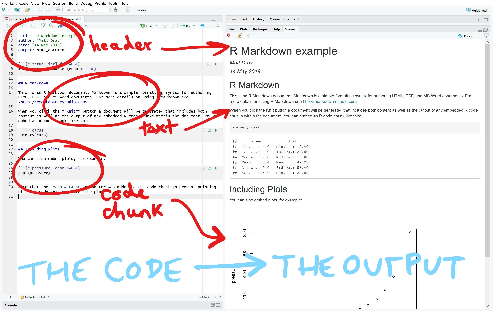

```{r setup, include=FALSE}
knitr::opts_chunk$set(echo = FALSE, message = FALSE, error = FALSE)
library(dplyr); library(knitr); library(ggplot2)
my_value <- "Lotad"
```

## Hello

* Who's used R?
* Who's used RMarkdown?

This talk isn't about coding.

It's about improving what we do.

<div class="notes">
R training sessions are coming!

Materials are available from the [R Training Course site](https://dfe-analytical-services.github.io/r-training-course/).
</div>

## The problem is the process

The Excel-Word approach is looooong and error-prone. Exaggerated example:

1. Receive non-machine-readable data in Excel format
2. Use a pre-prepared Excel template to reformat the data
3. Generate figures, tables and plots
4. Copy and paste to ~100-page Word document
5. Find error/need to alter something
6. Fix it
7. Spend ages re-copy-pasting the updated bits
8. Get confused about the current working version
9. Repeat steps 5 to 7 until 4am

## Is this reproducible?

Questions to ask yourself:

* are the steps recorded?
* what's the chance of human error (e.g. bad copy-paste)?
* is it easy to keep track of changes?
* could someone else reproduce it from scratch independently?

## Minimise the risk

We can reduce error and go faster with R Markdown.

1. Receive machine-readable data in Excel format
2. Run a pre-prepared file written with **R Markdown**
3. Make minor tweaks if needed and re-render stress-free
4. Use the saved time to prepare more informative commentary and have a cup of tea

## What's an R Markdown file?

A document with filetype .Rmd in which you:

* write plain text that's 'marked-up' with symbols (`*`, `[]`, `^`, etc)
* embed R code to read, process and visualise data
* click a button to render it to a HTML, Word or PDF

This is already being done in the department and across government ([Reproducible Analytical Pipelines](https://dataingovernment.blog.gov.uk/2017/03/27/reproducible-analytical-pipeline/)).

## What does it look like?


## What does it look like?



## Header

Enclosed in three hyphens. Specify metadata and what output should be produced.

```
---
title: "Your title"
author: "Your name"
date: "The date"
output:
  word_document:
    reference_docx: mystyles.docx
    highlight: "tango"
---

```

<div class="notes">
The header section doesn't contain R code.

It's a language called YAML, which stands for *Yet Another Markup Language*!
</div>


## Body text: formatting

You type:

```
*Italic*, **bold** super^script^ and a [link](www.gov.uk).
```

You get:

> *Italic*, **bold**, super^script^ and a [link](www.gov.uk).


## Body text: inline code (maths)

You can write some R code in the middle of a sentence! 

Wrap the code in backticks (the button under the Esc key) and start it with the letter `r`.

You type:

```{r eval=FALSE, echo=TRUE}
The answer to 1 + 1 is `r 1 + 1`
```

You get:

> The answer to 1 + 1 is `r 1 + 1`

## Inline code (stored values)

Let's say `my_value <- "Lotad"`

You type:

```{r eval=FALSE, echo=TRUE}
The best Pokemon is `r my_value`
```

<div class="notes">
Your choice of Pokemon is *wrong*.


</div>

You get:

> The best Pokemon is `r my_value`

## Code chunks: input

You type:

````
Here's an important plot of chick weights and feed types.

```{r chicks}`r ''`
chickwts %>%
  group_by(feed) %>% 
  ggplot() +
  geom_col(aes(x = feed, y = weight))
```
````

## Code chunks: output

You get:

> Here's an important table of chick weights and feed types.

```{r chicks}
chickwts %>%
  group_by(feed) %>% 
  ggplot() +
  geom_col(aes(x = feed, y = weight))
```

## Simple steps

1. In RStudio: File > New File > R Markdown
2. Write your text and embed your code
4. Click 'Knit' to render the document
5. The file is output to your current working directory

**DEMO TIME!**

## To summarise


## What's actually hapening?

Your R Markdown is rendered into 'plain' markdown by the package `knitr` (hence why you 'knit' to render the document), then something called `pandoc` converts it from markdown to your output format.

.Rmd `r emo::ji("arrow_right")` `knitr` `r emo::ji("arrow_right")` .md `r emo::ji("arrow_right")`  `pandoc` `r emo::ji("arrow_right")` .html/.pdf/.docx

This isn't *essential* knowledge.


## Further reading

* In RStudio: Help > Cheatsheets for hints and tips.
* [Introduction to R Markdown](https://rmarkdown.rstudio.com/lesson-1.html) (webpages featuring video)
* [Getting started with R Markdown](https://www.rstudio.com/resources/webinars/getting-started-with-r-markdown/) (video, 1 hr)
* [See the R Markdown gallery for examples of other document types](https://rmarkdown.rstudio.com/gallery.html), including dashboards, interactive documents, presentations (like this one) and books with R Markdown
* '[Knitting club](https://matt-dray.github.io/knitting-club/)', a Coffee & Coding session (webpage)
* A workflow with R Markdown works much better using an [R Project](https://support.rstudio.com/hc/en-us/articles/200526207-Using-Projects) and [version control](http://happygitwithr.com/), which are subjects for another day 